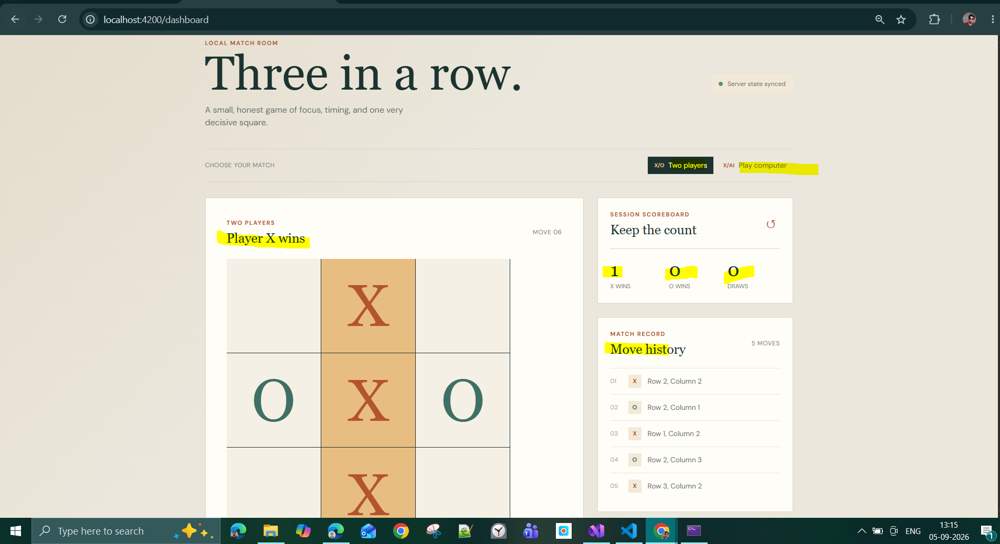
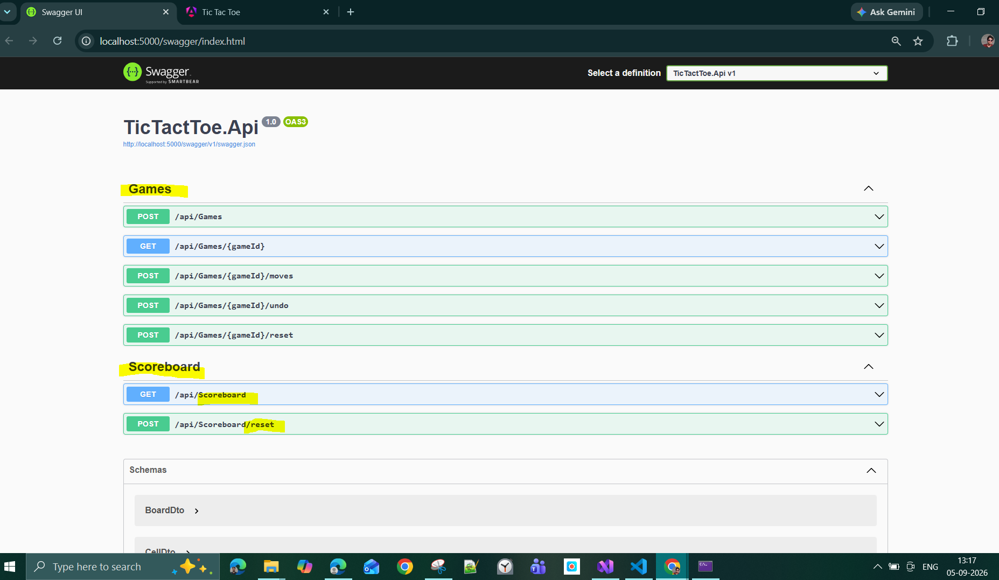

# Tic Tac Toe

A local browser-based Tic Tac Toe application with an Angular frontend and a .NET Web API backend.

## Overview

The backend owns the game state, validation, move history, game status, computer moves, and session scoreboard. The Angular application sends REST commands and renders the state returned by the API.

The implementation stays intentionally small: in-memory storage, one active session scoreboard, and no authentication or database setup.

## Screenshots

### Angular Frontend



### Swagger API



## Tech Stack

- Frontend: Angular 18, TypeScript, SCSS
- Backend: .NET 8 Web API
- API style: REST with Swagger in development
- Storage: in-memory
- Tests: xUnit for backend rules and Angular test configuration for the UI smoke tests

## Features

- 3 x 3 board with locked occupied cells
- Two Player mode
- Play Against Computer mode
- Deterministic computer priority: win, block, center, corner, available cell
- Turn validation and invalid-move errors
- Row, column, and diagonal win detection
- Draw detection
- Winning-cell highlighting
- Move history
- Mode-specific undo
- Session scoreboard for X wins, O wins, and draws
- Reset Game and Reset Scoreboard actions
- Responsive Angular UI

## Run Locally

### Backend

From `TicTactToe`:

```powershell
dotnet run --project Backend/TicTactToe.Api --launch-profile http
```

The API runs at `http://localhost:5000`. Swagger is available at `http://localhost:5000/swagger`.

### Frontend

Start the backend first, then from `TicTactToe`:

```powershell
cd Frontend
npm install
npm start -- --host localhost --port 4200
```

Open `http://localhost:4200/` in a browser.

## API Summary

| Method | Endpoint | Purpose |
| --- | --- | --- |
| POST | `/api/games` | Create a game with `TwoPlayer` or `Computer` mode |
| GET | `/api/games/{id}` | Get the current game state |
| POST | `/api/games/{id}/moves` | Submit a player move with player, row, and column |
| POST | `/api/games/{id}/undo` | Undo one move or a computer-mode move pair |
| POST | `/api/games/{id}/reset` | Reset the current game while preserving the scoreboard |
| GET | `/api/scoreboard` | Get the session scoreboard |
| POST | `/api/scoreboard/reset` | Reset the scoreboard |

The game response contains the game ID, mode, current player, status, winner, winning cells, board, move history, and scoreboard.

## Tests and Build

Backend rules tests:

```powershell
dotnet test Backend/TicTactToe.Core.Tests/TicTactToe.Core.Tests.csproj
```

Frontend production build:

```powershell
cd Frontend
npm run build
```

Frontend tests, when running the Angular test runner:

```powershell
npm test -- --watch=false
```

## Design Decisions

- In-memory state is sufficient for the local exercise and keeps setup simple.
- The backend is authoritative; the frontend does not reimplement game rules.
- Undo uses the permitted Option A: it is disabled after a completed game, so the scoreboard never needs reversal.
- In Computer Mode, X is the human player and O is applied automatically by the backend before the move response is returned.
- Row and column coordinates use values 1 through 3, matching the requirement's move-history example.

## Assumptions and Clarifications

- The scoreboard is shared by games while the backend process is running.
- Restarting the backend clears all in-memory games and scoreboard values.
- Reset Game clears only the current board and history; it does not reset the scoreboard.
- Starting the frontend creates a new game session in the selected mode.
- Computer fallback choices use stable row/column order for predictable tests.

## AI-Assisted Development

The development prompts and review record are kept in [PROMPT_LOG.md](PROMPT_LOG.md). The backend contract is documented in [BACKEND_SPECIFICATION.md](BACKEND_SPECIFICATION.md). AI-generated suggestions were reviewed against [requirement.md](requirement.md), and implementation decisions, assumptions, manual changes, and verification results were recorded.

## Known Limitations

- State is not persisted across backend restarts.
- The application supports a single local session scoreboard rather than accounts or online multiplayer.
- The frontend uses the configured local API URL `http://localhost:5000/api`.
- Angular's development test runner may require a browser environment; the production build and backend tests are the primary automated checks.

## Future Improvements

- Add environment-based frontend API configuration.
- Add API integration tests using an in-memory test host.
- Add broader Angular interaction tests for API success and error states.
- Add persistent storage only if the application moves beyond the local exercise.
